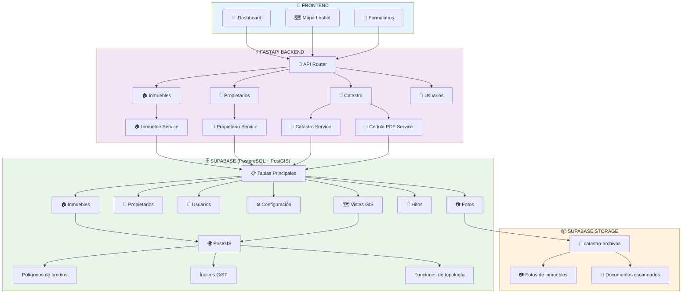
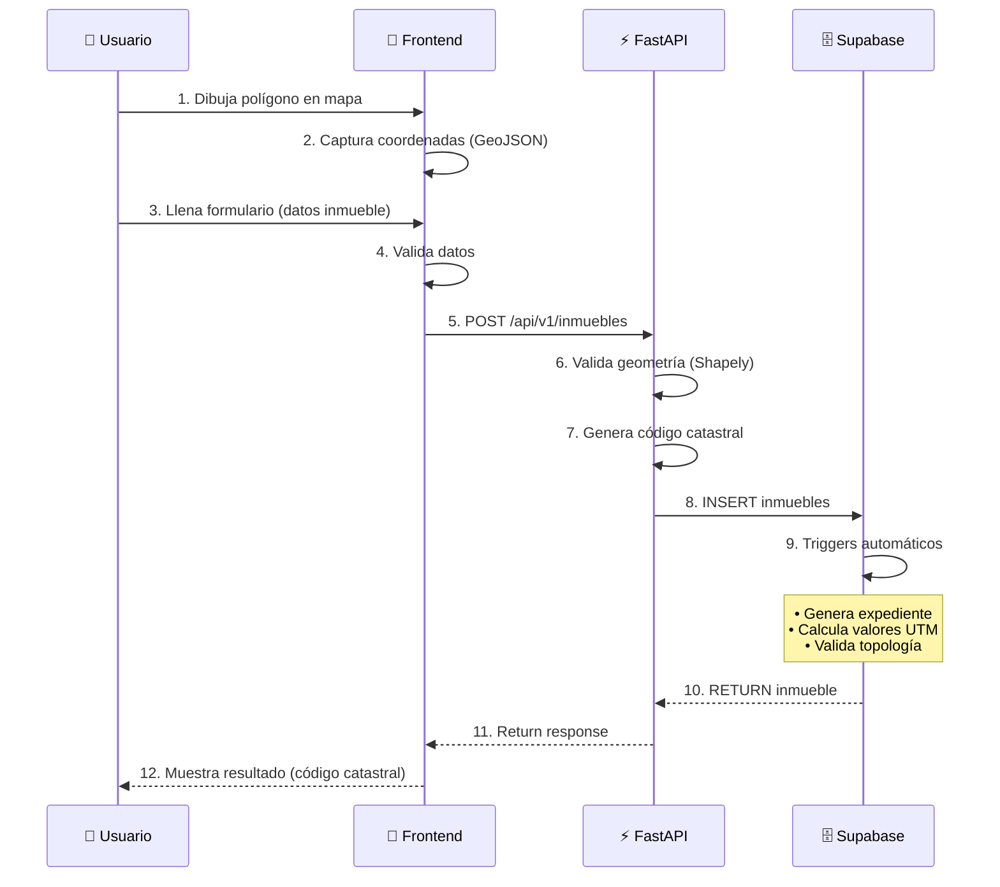
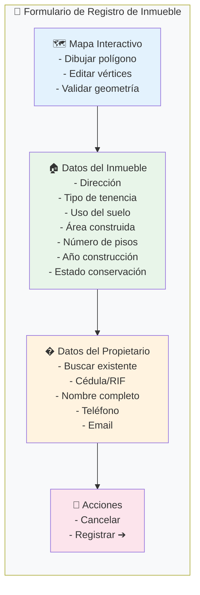

# FLUJOS DE TRABAJO - SRCM API

**Sistema de Registro Catastral Municipal - Guía de Flujos de Trabajo y Ejemplos Visuales**

## 📋 Índice

- [Arquitectura del Sistema](#arquitectura-del-sistema)
- [Flujo de Registro de Inmueble](#flujo-de-registro-de-inmueble)
- [Flujo de Generación de Cédula Catastral](#flujo-de-generación-de-cédula-catastral)
- [Flujo de Consulta de Mapa Catastral](#flujo-de-consulta-de-mapa-catastral)
- [Flujo de Gestión de Propietarios](#flujo-de-gestión-de-propietarios)
- [Flujo de Autenticación y Autorización](#flujo-de-autenticación-y-autorización)
- [Ejemplos de Request/Response](#ejemplos-de-requestresponse)

## 🏗️ Arquitectura del Sistema



## 🏠 Flujo de Registro de Inmueble

### 1. Proceso Completo



### 2. Interfaz del Formulario de Registro



### 3. Código Catastral Generado

El sistema genera automáticamente un código catastral de 23 caracteres:

```
┌─────────────────────────────────────────────────────────────────┐
│              ESTRUCTURA DEL CÓDIGO CATASTRAL (23 caracteres)       │
├─────────────────────────────────────────────────────────────────┤
│                                                                   │
│  EE MM PP SSS MMM PPP SPP NNN UUU                                │
│  │  │  │   │   │   │   │   │   │                                │
│  │  │  │   │   │   │   │   │   └─ Unidad (3 dígitos)            │
│  │  │  │   │   │   │   │   └───── Nivel (3 dígitos)             │
│  │  │  │   │   │   │   └───────── Subparcela (3 dígitos)        │
│  │  │  │   │   │   └─────────── Parcela (3 dígitos)             │
│  │  │  │   │   └─────────────── Manzana (3 dígitos)             │
│  │  │  │   └─────────────────── Sector (3 dígitos)              │
│  │  │  └─────────────────────── Parroquia (2 dígitos)           │
│  │  └────────────────────────── Municipio (2 dígitos)           │
│  └───────────────────────────── Estado (2 dígitos)               │
│                                                                   │
│  EJEMPLO: 20 27 01 001 001 001 000 000 001                     │
│            │  │  │   │   │   │   │   │                          │
│            │  │  │   │   │   │   │   └─ Unidad 001              │
│            │  │  │   │   │   │   └───── Nivel 000               │
│            │  │  │   │   │   └───────── Subparcela 000          │
│            │  │  │   │   └─────────── Parcela 001               │
│            │  │  │   └─────────────── Manzana 001               │
│            │  │  └─────────────────── Sector 001                │
│            │  └─────────────────────── Parroquia 01 (San Josecito)│
│            └────────────────────────── Municipio 27 (Torbes)    │
│            Estado 20 (Táchira)                                  │
│                                                                   │
└─────────────────────────────────────────────────────────────────┘
```

## 📄 Flujo de Generación de Cédula Catastral

### 1. Proceso Completo

```
┌─────────────────────────────────────────────────────────────────┐
│               FLUJO DE GENERACIÓN DE CÉDULA CATASTRAL             │
└─────────────────────────────────────────────────────────────────┘

    USUARIO                   FRONTEND                    BACKEND                  BASE DE DATOS
      │                          │                           │                           │
      │  1. Selecciona           │                           │                           │
      │     inmueble             │                           │                           │
      ├─────────────────────────>│                           │                           │
      │                          │                           │                           │
      │  2. Click "Generar       │                           │                           │
      │     Cédula Catastral"    │                           │                           │
      ├─────────────────────────>│                           │                           │
      │                          │                           │                           │
      │                          │  3. GET /api/v1/inmuebles/│                           │
      │                          │     {id}/cedula          │                           │
      │                          ├─────────────────────────>│                           │
      │                          │                           │                           │
      │                          │                           │  4. Query vista           │
      │                          │                           │     v_pdf_cedula_catastral│
      │                          │                           ├─────────────────────────>│
      │                          │                           │                           │
      │                          │                           │  5. Obtiene datos         │
      │                          │                           │     (inmueble, propietario,│
      │                          │                           │      configuración)       │
      │                          │                           │                           │
      │                          │                           │  6. Genera PDF           │
      │                          │                           │     (WeasyPrint + Jinja2) │
      │                          │                           │                           │
      │                          │                           │  7. Aplica plantilla     │
      │                          │                           │     oficial               │
      │                          │                           │                           │
      │                          │                           │  8. RETURN PDF bytes     │
      │                          │<─────────────────────────┤                           │
      │                          │                           │                           │
      │  9. Descarga PDF          │                           │                           │
      │<─────────────────────────┤                           │                           │
      │                          │                           │                           │
```

### 2. Mockup Visual de la Cédula Catastral

```
┌─────────────────────────────────────────────────────────────────┐
│                   CÉDULA CATASTRAL - PDF GENERADO                │
├─────────────────────────────────────────────────────────────────┤
│                                                                   │
│  ┌─────────────────────────────────────────────────────────┐    │
│  │  REPÚBLICA BOLIVARIANA DE VENEZUELA                       │    │
│  │  MINISTERIO DEL PODER POPULAR PARA INFRAESTRUCTURA        │    │
│  │                                                          │    │
│  │              ALCALDÍA DEL MUNICIPIO TORBES                │    │
│  │              ESTADO TÁCHIRA                                │    │
│  │                                                          │    │
│  │               DIRECCIÓN DE URBANISMO Y CATASTRO            │    │
│  └─────────────────────────────────────────────────────────┘    │
│                                                                   │
│  ┌─────────────────────────────────────────────────────────┐    │
│  │                    CÉDULA CATASTRAL                      │    │
│  │                                                          │    │
│  │  N° de Expediente: 000012/2025                           │    │
│  │  Fecha de Emisión: 14/09/2025                            │    │
│  │  Vigencia: Hasta 14/09/2026                              │    │
│  └─────────────────────────────────────────────────────────┘    │
│                                                                   │
│  ┌─────────────────────────────────────────────────────────┐    │
│  │  DATOS DEL INMUEBLE                                       │    │
│  ├─────────────────────────────────────────────────────────┤    │
│  │  Código Catastral: 20-27-01-001-001-001-000-000-001      │    │
│  │  Dirección: Calle Principal, Sector 01, San Josecito     │    │
│  │  Tipo de Tenencia: Propio                                 │    │
│  │  Uso del Suelo: Residencial                               │    │
│  │  Área del Terreno: 450.00 m²                              │    │
│  │  Área Construida: 180.00 m²                               │    │
│  │  Número de Pisos: 2                                       │    │
│  └─────────────────────────────────────────────────────────┘    │
│                                                                   │
│  ┌─────────────────────────────────────────────────────────┐    │
│  │  DATOS DEL PROPIETARIO                                   │    │
│  ├─────────────────────────────────────────────────────────┤    │
│  │  Nombre: Juan Pérez                                       │    │
│  │  Cédula: V-15.234.567                                     │    │
│  │  Dirección: Calle Principal #45, San Josecito             │    │
│  └─────────────────────────────────────────────────────────┘    │
│                                                                   │
│  ┌─────────────────────────────────────────────────────────┐    │
│  │  VALORACIÓN CATASTRAL                                    │    │
│  ├─────────────────────────────────────────────────────────┤    │
│  │  Valor del Terreno: Bs. 11,025,000.00                    │    │
│  │  Valor de la Construcción: Bs. 15,372,000.00            │    │
│  │  Valor Catastral Total: Bs. 26,397,000.00               │    │
│  │  Alicuota Impuesto: 0.30%                                 │    │
│  │  Impuesto Anual: Bs. 79,191.00                           │    │
│  └─────────────────────────────────────────────────────────┘    │
│                                                                   │
│  ┌─────────────────────────────────────────────────────────┐    │
│  │  COORDENADAS UTM (Huso 18N)                              │    │
│  ├─────────────────────────────────────────────────────────┤    │
│  │  Este:  254,321.45 m                                      │    │
│  │  Norte: 1,234,567.89 m                                   │    │
│  └─────────────────────────────────────────────────────────┘    │
│                                                                   │
│  ┌─────────────────────────────────────────────────────────┐    │
│  │  NOTAS LEGALES                                            │    │
│  ├─────────────────────────────────────────────────────────┤    │
│  │  1. Cédula Catastral que se expide a solicitud departe   │    │
│  │     interesada para fines legales.                       │    │
│  │  2. Los precios por m² del terreno y de la construcción  │    │
│  │     están sujetos a cambios.                             │    │
│  │  3. Si modifica dirección de acuerdo al nuevo           │    │
│  │     ordenamiento municipal.                              │    │
│  │  4. Un (01) año de vigencia desde la fecha de            │    │
│  │     expedición cumpliendo con la ORDENANZA SOBRE        │    │
│  │     CATASTRO.                                             │    │
│  │  5. NO AUTORIZA permiso para construir, ni para          │    │
│  │     Variables Urbanas. No acredita propiedad.            │    │
│  └─────────────────────────────────────────────────────────┘    │
│                                                                   │
│  ┌─────────────────────────────────────────────────────────┐    │
│  │  AUTORIDADES                                             │    │
│  ├─────────────────────────────────────────────────────────┤    │
│  │                                                          │    │
│  │  Dra. Charly Rojas                                       │    │
│  │  Alcaldesa Bolivariana y Primera Autoridad Civil         │    │
│  │  del Municipio Torbes, Estado Táchira                   │    │
│  │                                                          │    │
│  │  Acta de Sesión Solemne N° 78 de Fecha 02 de Agosto     │    │
│  │  de 2025                                                 │    │
│  │                                                          │    │
│  │  _________________________                                │    │
│  │  Directora de Urbanismo y Catastro                       │    │
│  └─────────────────────────────────────────────────────────┘    │
│                                                                   │
│  ┌─────────────────────────────────────────────────────────┐    │
│  │  RIF: G-20000395-2                                       │    │
│  │  Dirección: Municipio Torbes, San Josecito, Vía al       │    │
│  │              Llano, Troncal 5                            │    │
│  └─────────────────────────────────────────────────────────┘    │
│                                                                   │
└─────────────────────────────────────────────────────────────────┘
```

## 🗺️ Flujo de Consulta de Mapa Catastral

### 1. Proceso Completo

```
┌─────────────────────────────────────────────────────────────────┐
│               FLUJO DE CONSULTA DE MAPA CATASTRAL                 │
└─────────────────────────────────────────────────────────────────┘

    USUARIO                   FRONTEND                    BACKEND                  BASE DE DATOS
      │                          │                           │                           │
      │  1. Abre vista           │                           │                           │
      │     de mapa              │                           │                           │
      ├─────────────────────────>│                           │                           │
      │                          │                           │                           │
      │  2. Usuario hace         │                           │                           │
      │     zoom/pan             │                           │                           │
      ├─────────────────────────>│                           │                           │
      │                          │  3. Calcula bbox         │                           │
      │                          │     (visible area)       │                           │
      │                          │                           │                           │
      │                          │  4. GET /api/v1/catastro/│                           │
      │                          │     mapa?bbox=...         │                           │
      │                          ├─────────────────────────>│                           │
      │                          │                           │                           │
      │                          │                           │  5. Query con bbox       │
      │                          │                           │     (índice GiST)         │
      │                          │                           ├─────────────────────────>│
      │                          │                           │                           │
      │                          │                           │  6. ST_Intersects        │
      │                          │                           │     filtra polígonos     │
      │                          │                           │     visibles             │
      │                          │                           │                           │
      │                          │                           │  7. RETURN GeoJSON      │
      │                          │<─────────────────────────┤                           │
      │                          │                           │                           │
      │                          │  8. Renderiza polígonos    │                           │
      │                          │     en Leaflet/Mapbox     │                           │
      │                          │                           │                           │
      │  9. Usuario ve           │                           │                           │
      │     mapa con predios     │                           │                           │
      │<─────────────────────────┤                           │                           │
      │                          │                           │                           │
```

### 2. Mockup Visual del Mapa Catastral

```
┌─────────────────────────────────────────────────────────────────┐
│                   MAPA CATASTRAL INTERACTIVO                     │
├─────────────────────────────────────────────────────────────────┤
│                                                                   │
│  ┌─────────────────────────────────────────────────────────┐    │
│  │  CONTROLES DEL MAPA                                       │    │
│  │  [🔍+] [🔍-] [📍 Mi ubicación] [📐 Medir] [📷 Captura]    │    │
│  │  [🎨 Estilos: Catastral | Satélite | Híbrido]           │    │
│  │  [📊 Capas: Predios | Vías | Edificaciones]             │    │
│  └─────────────────────────────────────────────────────────┘    │
│                                                                   │
│  ┌─────────────────────────────────────────────────────────┐    │
│  │                                                          │    │
│  │  ┌─────────────────────────────────────────────────┐    │    │
│  │  │                                                 │    │    │
│  │  │              MAPA LEAFLET/MAPBOX                 │    │    │
│  │  │                                                 │    │    │
│  │  │  ┌─────────────────────────────────────┐       │    │    │
│  │  │  │    [███████████████████████████]    │       │    │    │
│  │  │  │    █ PREDIO 20-27-01-001-001-001   │       │    │    │
│  │  │  │    [███████████████████████████]    │       │    │    │
│  │  │  │                                         │       │    │    │
│  │  │  │  ┌───────────────────────────────┐   │       │    │    │
│  │  │  │  │   [███████████████████████]   │   │       │    │    │
│  │  │  │  │   █ PREDIO 20-27-01-001-001-002│   │       │    │    │
│  │  │  │  │   [███████████████████████]   │   │       │    │    │
│  │  │  │  └───────────────────────────────┘   │       │    │    │
│  │  │  │                                         │       │    │    │
│  │  │  │  ┌───────────────────────────────┐   │       │    │    │
│  │  │  │  │   [███████████████████████]   │   │       │    │    │
│  │  │  │  │   █ PREDIO 20-27-01-001-002-001│   │       │    │    │
│  │  │  │  │   [███████████████████████]   │   │       │    │    │
│  │  │  │  └───────────────────────────────┘   │       │    │    │
│  │  │  │                                         │       │    │    │
│  │  │  └─────────────────────────────────────┘       │    │    │
│  │  │                                                 │    │    │
│  │  │  📍 Usuario actual                             │    │    │
│  │  │                                                 │    │    │
│  │  └─────────────────────────────────────────────────┘    │    │
│  │                                                          │    │
│  └─────────────────────────────────────────────────────────┘    │
│                                                                   │
│  ┌─────────────────────────────────────────────────────────┐    │
│  │  PANEL LATERAL - INFORMACIÓN DEL PREDIO                  │    │
│  ├─────────────────────────────────────────────────────────┤    │
│  │  [Selecciona un predio en el mapa para ver detalles]    │    │
│  │                                                           │    │
│  │  ┌─────────────────────────────────────────────────┐    │    │
│  │  │ PREDIO SELECCIONADO:                             │    │    │
│  │  │ Código: 20-27-01-001-001-001                    │    │    │
│  │  │ Dirección: Calle Principal #45                   │    │    │
│  │  │ Propietario: Juan Pérez (V-15.234.567)          │    │    │
│  │  │ Área: 450 m²                                     │    │    │
│  │  │ Valor: Bs. 26,397,000                            │    │    │
│  │  │                                                  │    │    │
│  │  │ [📄 Ver Cédula] [✏️ Editar] [🗑️ Eliminar]       │    │    │
│  │  └─────────────────────────────────────────────────┘    │    │
│  │                                                           │    │
│  │  ┌─────────────────────────────────────────────────┐    │    │
│  │  │ FILTROS                                          │    │    │
│  │  │ Sector: [Todos ▼]                                │    │    │
│  │  │ Tenencia: [Todos ▼]                              │    │    │
│  │  │ Estado: [Todos ▼]                                │    │    │
│  │  │                                                  │    │    │
│  │  │ [🔍 Buscar por código o dirección]             │    │    │
│  │  └─────────────────────────────────────────────────┘    │    │
│  └─────────────────────────────────────────────────────────┘    │
│                                                                   │
└─────────────────────────────────────────────────────────────────┘
```

## 👥 Flujo de Gestión de Propietarios

### 1. Proceso Completo

```
┌─────────────────────────────────────────────────────────────────┐
│               FLUJO DE GESTIÓN DE PROPIETARIOS                     │
└─────────────────────────────────────────────────────────────────┘

    USUARIO                   FRONTEND                    BACKEND                  BASE DE DATOS
      │                          │                           │                           │
      │  1. Accede sección       │                           │                           │
      │     propietarios         │                           │                           │
      ├─────────────────────────>│                           │                           │
      │                          │                           │                           │
      │                          │  2. GET /api/v1/          │                           │
      │                          │     propietarios          │                           │
      │                          ├─────────────────────────>│                           │
      │                          │                           │                           │
      │                          │                           │  3. SELECT propietarios   │
      │                          │                           ├─────────────────────────>│
      │                          │                           │                           │
      │                          │                           │  4. RETURN lista          │
      │                          │<─────────────────────────┤                           │
      │                          │                           │                           │
      │  5. Muestra lista         │                           │                           │
      │     de propietarios       │                           │                           │
      │<─────────────────────────┤                           │                           │
      │                          │                           │                           │
      │  6. Click "Nuevo"         │                           │                           │
      ├─────────────────────────>│                           │                           │
      │                          │                           │                           │
      │  7. Llena formulario       │                           │                           │
      │     propietario           │                           │                           │
      ├─────────────────────────>│                           │                           │
      │                          │                           │                           │
      │                          │  8. POST /api/v1/         │                           │
      │                          │     propietarios          │                           │
      │                          ├─────────────────────────>│                           │
      │                          │                           │                           │
      │                          │                           │  9. INSERT propietario    │
      │                          │                           ├─────────────────────────>│
      │                          │                           │                           │
      │                          │                           │  10. RETURN propietario   │
      │                          │<─────────────────────────┤                           │
      │                          │                           │                           │
      │  11. Muestra confirmación │                           │                           │
      │<─────────────────────────┤                           │                           │
      │                          │                           │                           │
```

### 2. Mockup Visual de Gestión de Propietarios

```
┌─────────────────────────────────────────────────────────────────┐
│              GESTIÓN DE PROPIETARIOS - INTERFAZ                   │
├─────────────────────────────────────────────────────────────────┤
│                                                                   │
│  ┌─────────────────────────────────────────────────────────┐    │
│  │  [+ NUEVO PROPIETARIO]    [🔍 Buscar: _____________]    │    │
│  └─────────────────────────────────────────────────────────┘    │
│                                                                   │
│  ┌─────────────────────────────────────────────────────────┐    │
│  │  LISTA DE PROPIETARIOS (Paginación: 1 de 5)              │    │
│  ├─────────────────────────────────────────────────────────┤    │
│  │                                                           │    │
│  │  ┌─────────────────────────────────────────────────┐    │    │
│  │  │ 👤 Juan Pérez                                    │    │    │
│  │  │    Cédula: V-15.234.567                         │    │    │
│  │  │    Teléfono: 0414-123-4567                       │    │    │
│  │  │    Email: juan.perez@email.com                  │    │    │
│  │  │    Inmuebles: 3                                  │    │    │
│  │  │    [📋 Ver Detalles] [✏️ Editar] [🗑️ Eliminar]  │    │    │
│  │  └─────────────────────────────────────────────────┘    │    │
│  │                                                           │    │
│  │  ┌─────────────────────────────────────────────────┐    │    │
│  │  │ 👤 María González                                 │    │    │
│  │  │    Cédula: V-12.345.678                         │    │    │
│  │  │    Teléfono: 0416-987-6543                       │    │    │
│  │  │    Email: maria.gonzalez@email.com              │    │    │
│  │  │    Inmuebles: 1                                  │    │    │
│  │  │    [📋 Ver Detalles] [✏️ Editar] [🗑️ Eliminar]  │    │    │
│  │  └─────────────────────────────────────────────────┘    │    │
│  │                                                           │    │
│  │  ┌─────────────────────────────────────────────────┐    │    │
│  │  │ 🏢 Constructora ABC CA                           │    │    │
│  │  │    RIF: J-12345678-9                            │    │    │
│  │  │    Teléfono: 0274-123-4567                       │    │    │
│  │  │    Email: info@constructoraabc.com              │    │    │
│  │  │    Inmuebles: 7                                  │    │    │
│  │  │    [📋 Ver Detalles] [✏️ Editar] [🗑️ Eliminar]  │    │    │
│  │  └─────────────────────────────────────────────────┘    │    │
│  │                                                           │    │
│  └─────────────────────────────────────────────────────────┘    │
│                                                                   │
│  ┌─────────────────────────────────────────────────────────┐    │
│  │  [< Anterior]                    [Siguiente >]           │    │
│  └─────────────────────────────────────────────────────────┘    │
│                                                                   │
└─────────────────────────────────────────────────────────────────┘
```

## 🔐 Flujo de Autenticación y Autorización

### 1. Proceso Completo

```
┌─────────────────────────────────────────────────────────────────┐
│               FLUJO DE AUTENTICACIÓN Y AUTORIZACIÓN               │
└─────────────────────────────────────────────────────────────────┘

    USUARIO                   FRONTEND                SUPABASE AUTH              BACKEND              BASE DE DATOS
      │                          │                          │                          │                    │
      │  1. Login                │                          │                          │                    │
      │     (email/password)     │                          │                          │                    │
      ├─────────────────────────>│                          │                          │                    │
      │                          │  2. POST /auth/v1/...    │                          │                    │
      │                          ├─────────────────────────>│                          │                    │
      │                          │                          │                          │                    │
      │                          │                          │  3. Valida credenciales │                    │
      │                          │                          │                          │                    │
      │                          │                          │  4. Genera JWT token     │                    │
      │                          │                          │                          │                    │
      │                          │  5. RETURN token + user   │                          │                    │
      │                          │<─────────────────────────┤                          │                    │
      │                          │                          │                          │                    │
      │                          │  6. Trigger handle_new_user│                          │                    │
      │                          │  (crea registro en tabla │                          │                    │
      │                          │   usuarios de la BD)      │                          │                    │
      │                          │                          │                          │                    │
      │  7. Almacena token        │                          │                          │                    │
      │<─────────────────────────┤                          │                          │                    │
      │                          │                          │                          │                    │
      │  8. Request protegido    │                          │                          │                    │
      │     (con token)          │                          │                          │                    │
      ├─────────────────────────>│                          │                          │                    │
      │                          │  9. GET /api/v1/...       │                          │                    │
      │                          │     (Authorization: Bearer│                          │                    │
      │                          │      token)               │                          │                    │
      │                          ├─────────────────────────────────────────────────>│    │
      │                          │                          │                          │                    │
      │                          │                          │                          │ 10. Valida token    │
      │                          │                          │                          │    │
      │                          │                          │                          │ 11. Extrae user_id  │
      │                          │                          │                          │    │
      │                          │                          │                          │ 12. Verifica rol    │
      │                          │                          │                          │    │
      │                          │                          │                          │ 13. Ejecuta request │
      │                          │                          │                          │    │
      │                          │                          │                          │ 14. RETURN datos   │
      │                          │<─────────────────────────────────────────────────┤    │
      │                          │                          │                          │                    │
      │  15. Muestra resultado     │                          │                          │                    │
      │<─────────────────────────┤                          │                          │                    │
      │                          │                          │                          │                    │
```

### 2. Mockup Visual de Login

```
┌─────────────────────────────────────────────────────────────────┐
│                    PANTALLA DE LOGIN                              │
├─────────────────────────────────────────────────────────────────┤
│                                                                   │
│  ┌─────────────────────────────────────────────────────────┐    │
│  │                                                          │    │
│  │                  🔐 SRCM - CATASTRO                      │    │
│  │           Sistema de Registro Catastral Municipal        │    │
│  │               Municipio Torbes, Táchira                  │    │
│  │                                                          │    │
│  └─────────────────────────────────────────────────────────┘    │
│                                                                   │
│  ┌─────────────────────────────────────────────────────────┐    │
│  │  INICIAR SESIÓN                                          │    │
│  ├─────────────────────────────────────────────────────────┤    │
│  │                                                           │    │
│  │  Correo Electrónico:                                      │    │
│  │  [___________________________________________]           │    │
│  │                                                           │    │
│  │  Contraseña:                                              │    │
│  │  [___________________________________________]           │    │
│  │                                                           │    │
│  │  [☐] Recordarme                                           │    │
│  │                                                           │    │
│  │                  [INICIAR SESIÓN ➔]                      │    │
│  │                                                           │    │
│  │  ¿No tienes cuenta? [Regístrate aquí]                    │    │
│  │  ¿Olvidaste tu contraseña? [Recuperar]                   │    │
│  │                                                           │    │
│  └─────────────────────────────────────────────────────────┘    │
│                                                                   │
│  ┌─────────────────────────────────────────────────────────┐    │
│  │  O inicia sesión con:                                     │    │
│  │  [🔵 Google]  [⚫ Supabase]                               │    │
│  └─────────────────────────────────────────────────────────┘    │
│                                                                   │
└─────────────────────────────────────────────────────────────────┘
```

## 📝 Ejemplos de Request/Response

### Crear Inmueble

**Request:**
```bash
POST /api/v1/inmuebles
Content-Type: application/json
Authorization: Bearer <token>

{
  "sector": "01",
  "manzana": "001",
  "parcela": "001",
  "subparcela": "000",
  "nivel": "000",
  "unidad": "001",
  "direccion": "Calle Principal #45, San Josecito",
  "tenencia": "propio",
  "uso_suelo": "residencial",
  "area_construida": 180.00,
  "numero_pisos": 2,
  "ano_construccion": 2020,
  "estado_conservacion": "bueno",
  "geom": {
    "type": "Polygon",
    "coordinates": [[
      [-72.123456, 7.654321],
      [-72.123457, 7.654322],
      [-72.123458, 7.654323],
      [-72.123456, 7.654321]
    ]]
  },
  "propietario_id": "uuid-del-propietario"
}
```

**Response:**
```json
{
  "id": "uuid-del-inmueble",
  "codigo_catastral": "20-27-01-001-001-001-000-000-001",
  "expediente": "000012/2025",
  "direccion": "Calle Principal #45, San Josecito",
  "fecha_emision": "2025-09-14",
  "fecha_vencimiento": "2026-09-14",
  "tenencia": "propio",
  "uso_suelo": "residencial",
  "area_terreno": 450.00,
  "area_construida": 180.00,
  "valor_catastral_total": 26397000.00,
  "propietario": {
    "nombre": "Juan",
    "apellido": "Pérez",
    "cedula_rif": "V-15.234.567"
  },
  "coordenadas_utm": {
    "este": 254321.45,
    "norte": 1234567.89
  }
}
```

### Obtener Mapa Catastral

**Request:**
```bash
GET /api/v1/catastro/mapa?min_lon=-72.13&min_lat=7.65&max_lon=-72.12&max_lat=7.66
Authorization: Bearer <token>
```

**Response:**
```json
{
  "type": "FeatureCollection",
  "features": [
    {
      "type": "Feature",
      "geometry": {
        "type": "Polygon",
        "coordinates": [[
          [-72.123456, 7.654321],
          [-72.123457, 7.654322],
          [-72.123458, 7.654323],
          [-72.123456, 7.654321]
        ]]
      },
      "properties": {
        "id": "uuid-del-inmueble",
        "codigo_catastral": "20-27-01-001-001-001-000-000-001",
        "direccion": "Calle Principal #45",
        "propietario": "Juan Pérez",
        "valor_catastral": 26397000.00
      }
    }
  ]
}
```

### Descargar Cédula Catastral

**Request:**
```bash
GET /api/v1/inmuebles/{inmueble_id}/cedula
Authorization: Bearer <token>
```

**Response:**
```
Content-Type: application/pdf
Content-Disposition: attachment; filename="cedula_catastral_{uuid}.pdf"

[Binary PDF data]
```

## 🎯 Resumen de Endpoints Principales

| Endpoint | Método | Descripción | Requiere Auth |
|----------|--------|-------------|---------------|
| `/api/v1/inmuebles` | POST | Crear inmueble | ✅ |
| `/api/v1/inmuebles` | GET | Listar inmuebles | ✅ |
| `/api/v1/inmuebles/{id}` | GET | Obtener inmueble | ✅ |
| `/api/v1/inmuebles/{id}` | PATCH | Actualizar inmueble | ✅ |
| `/api/v1/inmuebles/{id}` | DELETE | Eliminar inmueble | 🔒 Admin |
| `/api/v1/inmuebles/{id}/cedula` | GET | Descargar cédula PDF | ✅ |
| `/api/v1/propietarios` | POST | Crear propietario | ✅ |
| `/api/v1/propietarios` | GET | Listar propietarios | ✅ |
| `/api/v1/propietarios/{id}` | GET | Obtener propietario | ✅ |
| `/api/v1/propietarios/{id}` | PATCH | Actualizar propietario | ✅ |
| `/api/v1/propietarios/{id}` | DELETE | Eliminar propietario | 🔒 Admin |
| `/api/v1/catastro/mapa` | GET | Mapa catastral GeoJSON | ✅ |
| `/api/v1/catastro/estadisticas` | GET | Estadísticas generales | ✅ |
| `/api/v1/catastro/solapamientos` | GET | Auditoría topológica | 🔒 Admin |
| `/api/v1/usuarios/me` | GET | Perfil actual | ✅ |
| `/api/v1/usuarios` | GET | Listar usuarios | 🔒 Admin |
| `/api/v1/usuarios/{id}/rol` | PATCH | Cambiar rol | 🔒 Admin |

## 📞 Soporte y Ayuda

Para más información:
- Consulta el `README.md` para instalación y configuración
- Visita `/docs` cuando el servidor esté corriendo para documentación interactiva
- Revisa los logs del servidor para errores detallados

---

**Desarrollado para la Alcaldía del Municipio Torbes, Estado Táchira, Venezuela**
